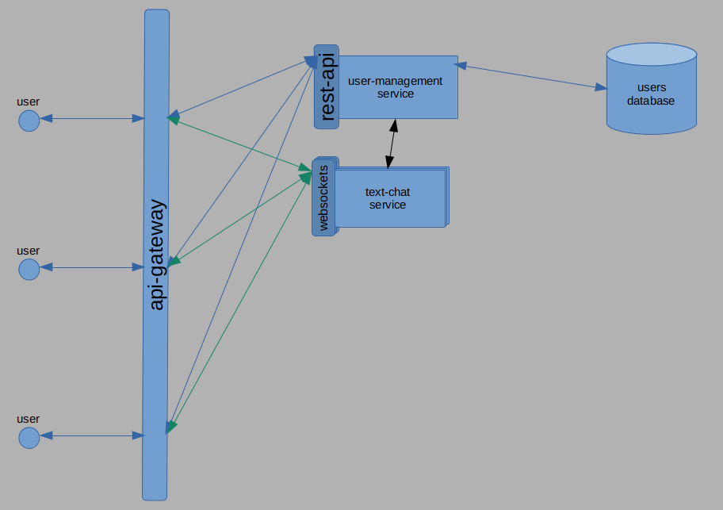

# CHATME
A couple of distributed services making up a simple chat app just to demonstrate my current skills in making clean, reliable, readable and testable systems :)

# SERVICES
The current view of services will contain
- Users service.

# Current Architecture State

