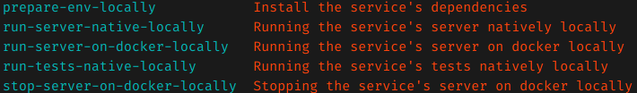

# TEXT-CHAT
Here it's the service which is responsible for any text chat related actions which are
- Send text message to all connected users.
- Receive text message from a connected user.

# ARCHITECTURE
**`System Architecture`**

The architecture of the service is done somehow close to the [clean_architecture](https://blog.cleancoder.com/uncle-bob/2012/08/13/the-clean-architecture.html) by uncle bob.

# Required tools to be up and running

- [node.js](https://nodejs.org/en/download/) # as the programming language of this service. (sure you can use a container for that using something like [Docker](https://www.docker.com/))
- [yarn](https://yarnpkg.com/) # as a package manager for the ts/js libraries (installing and managing environments and dependencies here in this service)
- [make](https://www.gnu.org/software/make/) # as building/scripting tool

# Usage
- running `$ make` command on any of your terminals (Linux, Mac or Windows) # For all the possible commands currently available for the project

# TODO

# GITHUB-BUILD-STATUS
