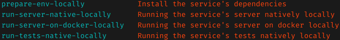

# USERS
Here it's the service which is responsible of any user related actions which are
- Registration.
- Login.

# ARCHITECTURE
`**System Architecture**`

The architecture of the service is done some how close to the [clean_architecture](https://blog.cleancoder.com/uncle-bob/2012/08/13/the-clean-architecture.html) by uncle bob.

**`REST-API Diagram`**

# Required tools to be up and running

- [python3.7+](https://www.python.org/download/releases/3.0/) # as the programming language of this service. (sure you can use a container for that using something like [Docker](https://www.docker.com/))
- [pipenv](https://pypi.org/project/pipenv/) # as a python development workflow tool (installing and managing environments and dependencies here in this service)
- [make](https://www.gnu.org/software/make/) # as building/scripting tool

# Usage
- running `$ make` command on any of your terminals (Linux, Mac or Windows) # For all the possible commands currently available for the project

# TODO
- [x] Architecture diagram of the service.
- [x] Good generated swagger documentation for any contained API.
- [ ] Good generated documentation about how to setup/build and run the service with it's dependencies.

# GITHUB-BUILD-STATUS

